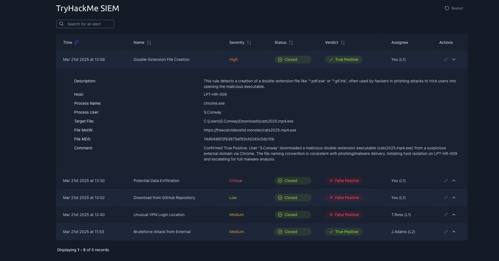

# TryHackMe SIEM Alert Investigation Project

## Project Overview

This project documents my hands-on experience using a SIEM-style security monitoring environment in TryHackMe. The goal of this project was to analyze security alerts, review suspicious activity, classify alerts, and practice the type of investigation workflow used by SOC analysts and cybersecurity support teams.

This project is part of my cybersecurity learning portfolio and demonstrates my ability to review alerts, document findings, and explain security events in a clear and professional way.

## Objective

The objective of this lab was to review SIEM alerts, analyze event details, determine whether alerts were true positives or false positives, and document the investigation process.

## Tools Used

- TryHackMe SIEM environment
- Security alert dashboard
- Log analysis workflow
- Incident investigation process
- Basic SOC analyst methodology

## Skills Demonstrated

- SIEM alert review
- Alert triage
- Log analysis
- Threat detection
- Incident documentation
- True positive vs. false positive classification
- Cybersecurity investigation workflow
- Security event analysis

## Investigation Summary

During this lab, I reviewed multiple security alerts inside the TryHackMe SIEM dashboard. The alerts included events with different severity levels such as low, medium, high, and critical.

The investigation required reviewing key alert details, including:

- Alert name
- Severity level
- Status
- Verdict
- Host information
- Process name
- Target file
- File hash
- Comments and analyst notes

One of the alerts shown involved a suspicious file creation event. The alert contained information such as the host, process name, target file path, and file hash. Based on the alert details, the event was reviewed and classified as suspicious activity that required further analysis.

## Screenshot

## Key Takeaways

This project helped me better understand how cybersecurity analysts use SIEM dashboards to monitor alerts, investigate suspicious activity, and document findings.

I learned the importance of reviewing alert context before making a decision. A security analyst should not only look at the alert name or severity but should also review supporting details such as process behavior, file path, host information, hash values, and analyst comments.

## What I Learned

Through this project, I practiced:

- Reading and interpreting SIEM alerts
- Understanding alert severity levels
- Reviewing suspicious file activity
- Differentiating between true positives and false positives
- Documenting findings like a SOC analyst
- Explaining technical information in a professional format

## Professional Relevance

This project is relevant to entry-level cybersecurity, SOC analyst, help desk security support, and IT support roles because it demonstrates hands-on exposure to security monitoring, alert investigation, and documentation.

## Disclaimer

This project is based on a TryHackMe lab environment. No flags, answers, private lab solutions, or sensitive information are included. The purpose of this project is to document my learning process and demonstrate cybersecurity skills professionally. 
